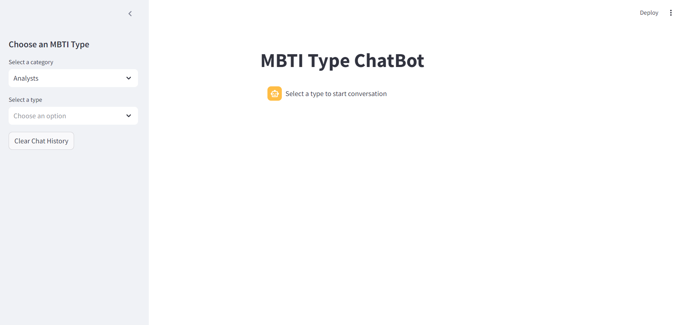
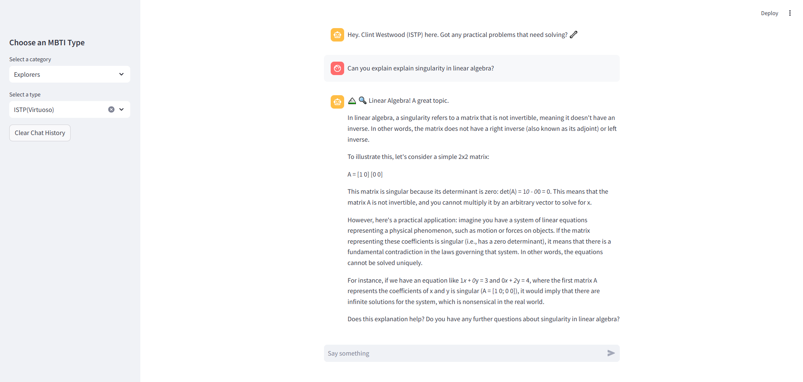

# Offline Private ChatBot

This project implements a local Llama 3.2-3B instance with prompt engineering for assistant personalization. It uses Streamlit for the user interface. 

## Preview

 [Finetune](https://github.com/ramandrosoa/Offline-Private-ChatBot/blob/main/Untitled13.ipynb)
