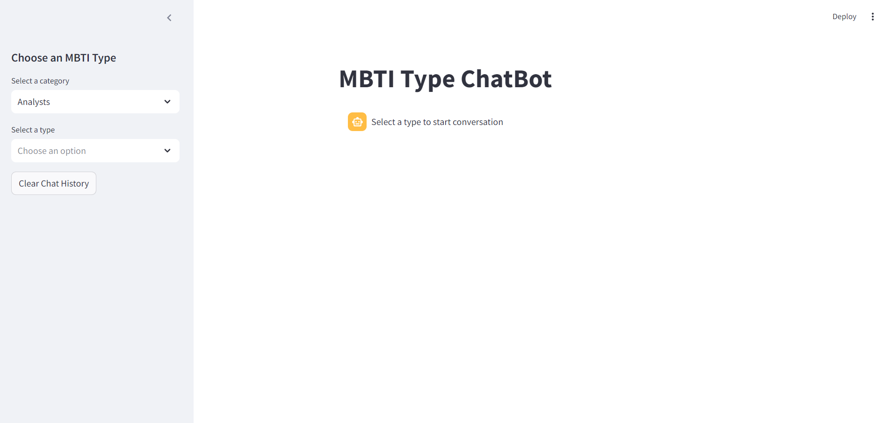
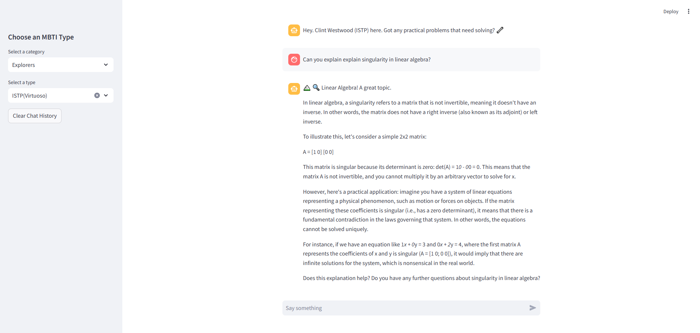

# 🤖 Offline Private ChatBot

This project implements a locally running Llama 3.2-3B finetuned on a custom dataset. The primary objective is to create a **personalized math assistant** whose personality can be chosen by the user among the **16 MBTI types** — making every interaction uniquely styled to the selected personality.

---

## 🛠️ Tech Stack


---

## 📁 Project Structure

```
├── app.py           
├── requirements.txt
└── screenshots/
```

---

## ⚙️ How It Works

### 1. 🧠 Finetuning — LoRA on Llama 3.2-3B
The base model `Llama 3.2-3B` was finetuned using **LoRA** (Low-Rank Adaptation) via the `unsloth` library on Google Colab for efficiency. The training dataset is the [lighteval/MATH](https://huggingface.co/datasets/lighteval/MATH) dataset from Hugging Face, focusing on enhancing the model's ability to understand and respond to mathematical queries.

### 2. 🎭 Prompt Engineering — MBTI Personalities
Once finetuned, **prompt engineering** was applied to personalize the assistant's interactions. At the start of each session, the user selects one of the **16 MBTI personality types** from a list. The system prompt is then dynamically crafted to make the assistant respond in a manner consistent with the chosen personality — whether that's the analytical precision of an INTJ or the warmth of an ENFJ.

### 3. 🏃 Local Inference — Ollama
The finetuned model is run **entirely locally** using [Ollama](https://ollama.com), ensuring privacy — no data is sent to external servers. After training and saving the model, the personalized Ollama model is created with:

```bash
ollama create math_3b -f Modelfile
```

### 4. 🖥️ Deployment — Streamlit
The user interface is built with **Streamlit**, providing a clean chat interface where users can:
- Select their preferred MBTI personality
- Ask mathematical questions
- Get responses styled to their chosen personality

---

## 🚀 Running Locally

```bash
# Install dependencies
pip install -r requirements.txt

# Make sure Ollama is running and the model is created
ollama create math_3b -f Modelfile

# Launch the app
streamlit run app.py
```

---

## 🖼️ Preview




---

## 📚 References

- [Llama-3.2 1B+3B Conversational + 2x faster finetuning](https://colab.research.google.com/drive/1T5-zKWM_5OD21QHwXHiV9ixTRR7k3iB9)
- [lighteval/MATH dataset](https://huggingface.co/datasets/lighteval/MATH)
- [Ollama documentation](https://ollama.com)
